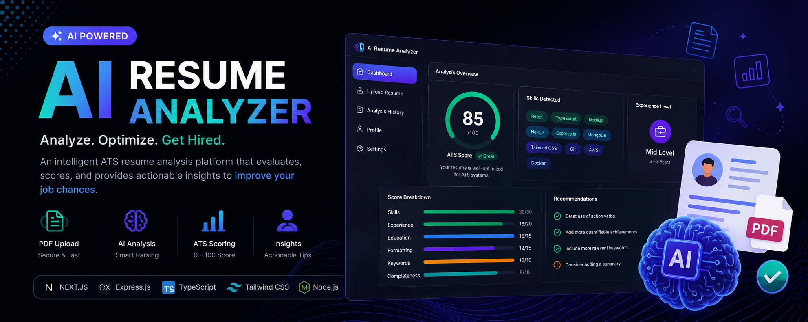
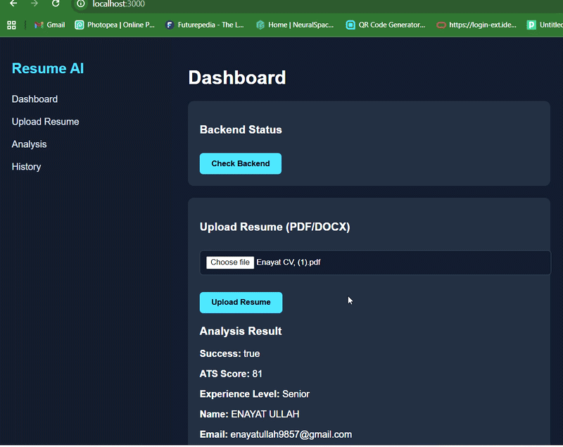
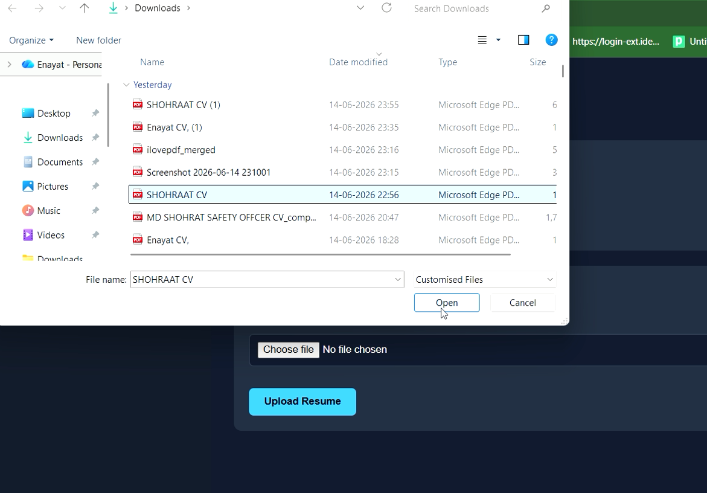
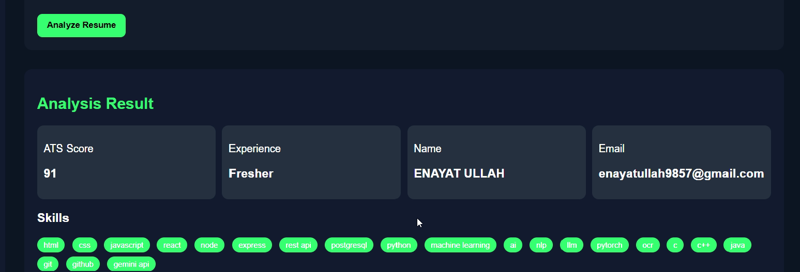
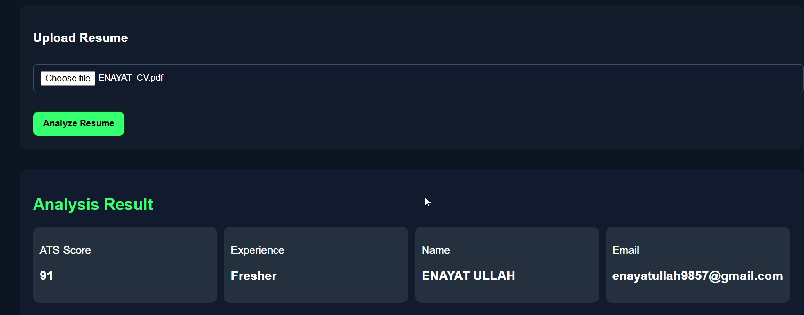
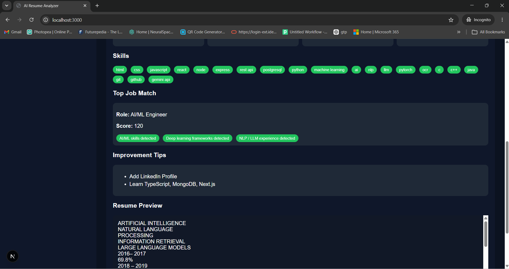

<!-- ========================================================= -->

<!-- HERO BANNER -->

<!-- ========================================================= -->

<p align="center">
  
</p>

<h1 align="center">
🚀 AI Resume Analyzer
</h1>

<p align="center">
An intelligent ATS Resume Analysis Platform that helps job seekers evaluate, optimize, and improve their resumes using AI-powered insights.
</p>

<p align="center">


</p>

---

# 📌 Overview

Finding a job has become increasingly competitive.

Most companies use an **Applicant Tracking System (ATS)** to automatically screen resumes before they ever reach a recruiter.

A resume that isn't ATS-friendly often gets rejected—even if the candidate has excellent skills.

**AI Resume Analyzer** solves this problem by providing an intelligent ATS analysis platform capable of:

* 📄 Extracting resume content
* 🧠 Detecting important skills
* 📊 Generating ATS compatibility scores
* 👨 Detecting candidate information
* 📈 Estimating experience level
* 💡 Providing structured analysis for future AI enhancements

Designed with a modern SaaS architecture, this project demonstrates real-world full-stack development using **Next.js**, **Express.js**, and **TypeScript**.

---

# ✨ Features

## 📄 Resume Upload

* Upload PDF resumes instantly
* Drag & Drop support
* File validation
* Upload progress

---

## 🧠 Intelligent Resume Parsing

Automatically extracts:

* Name
* Email
* Phone Number
* Skills
* Experience
* Education
* Resume Text

---

## 📊 ATS Score Generation

The application evaluates resumes using multiple parameters:

* Resume completeness
* Skill coverage
* Contact information
* Experience
* Formatting quality
* Keyword presence

Final output:

```
ATS Score: 0 — 100
```

---

## 💼 Candidate Profile Detection

Automatically identifies

* Fresher
* Junior
* Mid-Level
* Senior

based on resume content.

---

## 🔍 Skill Extraction

Detects technologies like:

* React
* Node.js
* Express.js
* Java
* Python
* SQL
* MongoDB
* PostgreSQL
* Docker
* Git
* AWS
* TypeScript
* JavaScript
* Next.js

and many more.

---

## ⚡ Fast Modern UI

Built using

* Next.js App Router
* TypeScript
* Tailwind CSS

Features include

* Responsive Design
* Fast Rendering
* Mobile Friendly
* Dark UI
* Clean Dashboard

---

## 📦 Structured API Response

The backend returns a clean JSON structure that can easily integrate with:

* AI Agents
* LLM Pipelines
* Job Platforms
* HR Software
* Resume Builders

---

# 🎯 Why This Project?

This project demonstrates several real-world software engineering concepts:

✅ REST API Design

✅ Full Stack Architecture

✅ File Upload System

✅ PDF Parsing

✅ ATS Scoring Logic

✅ Resume Intelligence

✅ Clean UI/UX

✅ Modular Backend

✅ Type Safety

✅ Production Folder Structure

---

# 🛠 Technology Stack

| Category        | Technologies |
| --------------- | ------------ |
| Frontend        | Next.js 15   |
| Language        | TypeScript   |
| Styling         | Tailwind CSS |
| Backend         | Express.js   |
| Runtime         | Node.js      |
| PDF Parsing     | pdf-parse    |
| HTTP Client     | Axios        |
| API             | REST API     |
| File Upload     | Multer       |
| Package Manager | npm          |

---

# 🏛 Architecture

```text
                 User
                  │
                  ▼
        Next.js Frontend
                  │
      Upload Resume (PDF)
                  │
                  ▼
        Express Backend API
                  │
          Multer Upload
                  │
                  ▼
            pdf-parse
                  │
                  ▼
      Resume Text Extraction
                  │
                  ▼
      ATS Analysis Engine
                  │
      ├── Skill Detection
      ├── Name Detection
      ├── Experience Detection
      ├── Contact Detection
      └── ATS Score
                  │
                  ▼
        Structured JSON
                  │
                  ▼
      Frontend Dashboard
```

---

# 🔄 Application Workflow

```text
Upload Resume
      │
      ▼
PDF Validation
      │
      ▼
Backend Upload
      │
      ▼
Resume Parsing
      │
      ▼
Extract Resume Text
      │
      ▼
Analyze Candidate
      │
      ▼
Generate ATS Score
      │
      ▼
Return JSON
      │
      ▼
Display Dashboard
```

---

# 🎬 Demo

<p align="center">



</p>

---

# 📸 Screenshots

## Upload Page

<p align="center">



</p>

---

## Resume Analysis

<p align="center">



</p>

---

## ATS Score

<p align="center">



</p>

---

## Skill Extraction

<p align="center">



</p>

---
---

# 📂 Project Structure

```text
ai-resume-analyzer/
│
├── frontend/
│   ├── app/
│   ├── components/
│   ├── hooks/
│   ├── services/
│   ├── types/
│   ├── utils/
│   ├── public/
│   ├── package.json
│   └── tsconfig.json
│
├── backend/
│   ├── src/
│   │   ├── controllers/
│   │   ├── routes/
│   │   ├── services/
│   │   ├── middleware/
│   │   ├── utils/
│   │   ├── config/
│   │   ├── types/
│   │   └── index.ts
│   │
│   ├── uploads/
│   ├── package.json
│   └── tsconfig.json
│
├── docker/
│
├── assets/
│   ├── banner/
│   ├── demo/
│   └── screenshots/
│
├── docker-compose.yml
├── .env.example
├── README.md
└── project-structure.txt
```

---

# ⚙️ System Requirements

| Software | Version     |
| -------- | ----------- |
| Node.js  | 18+         |
| npm      | 9+          |
| Git      | Latest      |
| VS Code  | Recommended |

---

# 🚀 Getting Started

## 1️⃣ Clone Repository

```bash
git clone https://github.com/ENAYATULLA/ai-resume-analyzer.git

cd ai-resume-analyzer
```

---

## 2️⃣ Install Backend

```bash
cd backend

npm install
```

Run development server

```bash
npm run dev
```

Backend runs on

```text
http://localhost:5000
```

---

## 3️⃣ Install Frontend

```bash
cd ../frontend

npm install
```

Run

```bash
npm run dev
```

Frontend runs on

```text
http://localhost:3000
```

---

# 🌍 Environment Variables

## Backend

Create

```text
backend/.env
```

```env
PORT=5000
NODE_ENV=development
```

---

## Frontend

Create

```text
frontend/.env.local
```

```env
NEXT_PUBLIC_API_URL=http://localhost:5000
```

---

# 🐳 Docker Support

Run the complete application using Docker Compose.

```bash
docker compose up --build
```

Run in detached mode

```bash
docker compose up -d
```

Stop containers

```bash
docker compose down
```

---

# 📡 REST API

---

## Upload Resume

```http
POST /api/resume/upload
```

### Request

Multipart Form Data

| Field  | Type |
| ------ | ---- |
| resume | PDF  |

---

### Response

```json
{
  "success": true,
  "message": "Resume analyzed successfully."
}
```

---

## Analyze Resume

```http
POST /api/resume/analyze
```

Returns

* ATS Score
* Skills
* Candidate Name
* Experience
* Resume Details

---

# 📊 Example Response

```json
{
  "name": "Enayat Ullah",
  "email": "enayat@example.com",
  "phone": "+91XXXXXXXXXX",
  "skills": [
    "React",
    "Node.js",
    "TypeScript",
    "Next.js",
    "Express.js"
  ],
  "experience": "Fresher",
  "atsScore": 87
}
```

---

# 📈 ATS Scoring Criteria

The ATS engine evaluates resumes using multiple parameters.

| Category            | Weight |
| ------------------- | ------ |
| Contact Information | 15%    |
| Skills Match        | 30%    |
| Experience          | 20%    |
| Education           | 15%    |
| Resume Completeness | 10%    |
| Keyword Density     | 10%    |

---

# 🔄 Resume Analysis Pipeline

```text
Resume Upload
        │
        ▼
PDF Validation
        │
        ▼
Text Extraction
        │
        ▼
Resume Parsing
        │
        ▼
Candidate Detection
        │
        ▼
Skill Extraction
        │
        ▼
Experience Estimation
        │
        ▼
ATS Score Calculation
        │
        ▼
Structured JSON Response
        │
        ▼
Frontend Dashboard
```

---

# 📦 Main Technologies

| Library      | Purpose            |
| ------------ | ------------------ |
| Next.js      | Frontend Framework |
| React        | UI                 |
| TypeScript   | Type Safety        |
| Tailwind CSS | Styling            |
| Express.js   | Backend API        |
| Multer       | File Upload        |
| pdf-parse    | PDF Parsing        |
| Axios        | HTTP Requests      |

---

# ⚡ Performance Highlights

* Fast PDF parsing
* Lightweight backend
* Modular architecture
* Responsive UI
* RESTful API
* Type-safe codebase
* Clean folder structure
* Reusable components
* Production-ready project organization

---

# 🔐 Security

Current implementation includes

* File type validation
* PDF-only uploads
* Error handling
* Input validation
* Safe API responses

Future improvements

* JWT Authentication
* Rate Limiting
* Helmet Security
* Request Validation
* Virus Scanning
* File Size Restrictions
* User Accounts

---

# 🌐 Deployment

Frontend can be deployed to

* Vercel
* Netlify

Backend can be deployed to

* Render
* Railway
* DigitalOcean
* AWS EC2
